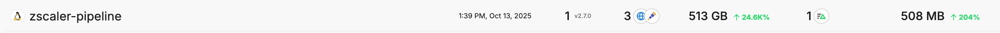
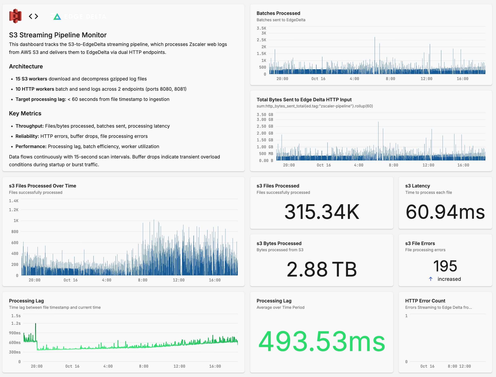

# S3 to EdgeDelta Streamer

```
███████╗██████╗        ███████╗████████╗██████╗ ███████╗ █████╗ ███╗   ███╗███████╗██████╗
██╔════╝██╔══██╗      ██╔════╝╚══██╔══╝██╔══██╗██╔════╝██╔══██╗████╗ ████║██╔════╝██╔══██╗
█████╗  ██║  ██║█████╗███████╗   ██║   ██████╔╝█████╗  ███████║██╔████╔██║█████╗  ██████╔╝
██╔══╝  ██║  ██║╚════╝╚════██║   ██║   ██╔══██╗██╔══╝  ██╔══██║██║╚██╔╝██║██╔══╝  ██╔══██╗
███████╗██████╔╝      ███████║   ██║   ██║  ██║███████╗██║  ██║██║ ╚═╝ ██║███████╗██║  ██║
╚══════╝╚═════╝       ╚══════╝   ╚═╝   ╚═╝  ╚═╝╚══════╝╚═╝  ╚═╝╚═╝     ╚═╝╚══════╝╚═╝  ╚═╝

    ╔═══════════════════════════════════════════════════════╗
    ║     High-Performance S3 to EdgeDelta Data Streaming   ║
    ╚═══════════════════════════════════════════════════════╝
```

High-performance streaming pipeline that processes log files from AWS S3 and delivers them to EdgeDelta in real-time via HTTP. Supports multiple log formats including Zscaler, Cisco Umbrella, and custom formats with Redis-backed state management for distributed deployments.

## Installation

### Prerequisites

1. **EdgeDelta agent** installed and running
2. **AWS credentials** with S3 read access (s3:GetObject, s3:ListBucket)
3. **Root/sudo access** for installation
4. **AWS CLI** installed (for credential validation)

### Quick Install

```bash
# Navigate to the project directory
cd /path/to/s3-edgedelta-streamer

# Run the interactive installer
sudo ./install.sh
```

The installer will:
1. ✓ Validate EdgeDelta is installed and running
2. ✓ Prompt for AWS credentials and S3 configuration
3. ✓ Test S3 access and AWS credentials
4. ✓ Encrypt credentials using machine-specific key (AES-256)
5. ✓ Install binary to `/opt/edgedelta/s3-streamer/`
6. ✓ Create systemd service with EdgeDelta dependencies
7. ✓ Enable and start the service automatically

**Important**: Deploy your EdgeDelta pipeline (via UI) before running the installer to ensure ports 8080, 8081, and 4317 are available.

### Installation Details

**Install Location**: `/opt/edgedelta/s3-streamer/`
```
├── bin/s3-edgedelta-streamer      # Binary
├── config/config.yaml             # Configuration
└── logs/streamer.log              # Application logs
```

**Encrypted Credentials**: `/etc/systemd/creds/s3-streamer/`
- Machine-specific encryption (AES-256)
- Root-only access (0600 permissions)
- Not portable to other machines

**State File**: `/var/lib/s3-streamer/state.json`
- Tracks last processed timestamp
- Enables resumable processing

### Service Management

The service automatically:
- Starts when EdgeDelta starts
- Stops when EdgeDelta stops
- Restarts when EdgeDelta restarts
- Starts at boot (if EdgeDelta starts at boot)

```bash
# Check status
sudo systemctl status s3-streamer

# View logs
sudo journalctl -u s3-streamer -f
tail -f /opt/edgedelta/s3-streamer/logs/streamer.log

# Manually restart
sudo systemctl restart s3-streamer

# Stop (will auto-start with EdgeDelta)
sudo systemctl stop s3-streamer
```

### Reconfiguration

To change settings after installation:

```bash
# Stop service
sudo systemctl stop s3-streamer

# Edit configuration
sudo nano /opt/edgedelta/s3-streamer/config/config.yaml

# Restart service
sudo systemctl start s3-streamer
```

To change AWS credentials, reinstall:
```bash
sudo ./install.sh
# The installer will detect existing installation and offer to reconfigure
```

### Uninstallation

```bash
sudo ./uninstall.sh
```

Removes service, binary, configuration, and encrypted credentials. Optionally preserves state file for future reinstallation.

- **Go version**: 1.21+ (uses slog structured logging)
- **Linting**: golangci-lint configuration
- **Testing**: Go's built-in testing framework
- **Coverage**: 80%+ target across testable components
- **Dependencies**: Minimal, audited dependencies only

## Architecture

```
S3 Files (gzipped JSONL)
    ↓
15 S3 Workers (download & decompress)
    ↓
10,000-line buffer
    ↓
10 HTTP Workers (batch & send)
    ↓
EdgeDelta HTTP Inputs (8080, 8081)
    ↓
EdgeDelta Processing & Backend
```

**Key Design Decisions:**
- **HTTP streaming**: Eliminates file I/O overhead
- **Dual endpoints**: Load balances ingestion across 2 HTTP inputs
- **Round-robin distribution**: 10 workers split evenly across endpoints
- **State management**: File-based by default, Redis optional for distributed deployments

### Pipeline Status



The EdgeDelta pipeline (`zscaler-pipeline`) actively ingests data with the following characteristics:
- **Data Volume**: 513 GB processed (+24.86% growth)
- **Throughput**: 508 MB recent activity (+204% increase)
- **Active Agents**: 3 agents processing in real-time

## Performance Characteristics

**Real-World Results:**
- **Throughput**: 228 MB/minute (13.7 GB/hour)
- **Processing Lag**: ~31 seconds average (target: < 60s)
- **Resource Usage**: 14% CPU, 147 MB RAM (streamer)
- **Data Loss**: Zero in steady state
- **Files Processed**: 315K+ files
- **Total Data**: 2.88 TB processed
- **Latency**: 60ms average per file

### Performance Dashboard



The monitoring dashboard shows production performance metrics:
- **S3 Files Processed**: 315.34K files successfully processed
- **Total Bytes**: 2.88 TB of data streamed to EdgeDelta
- **Processing Latency**: 60.94ms average per file
- **Processing Lag**: 493.53ms (well under 60-second target)
- **Batches Sent**: 3.5K batches/minute steady throughput
- **HTTP Errors**: 195 total (minimal error rate over lifetime)
- **Continuous Operation**: 15-second scan intervals with consistent performance

## Log Format Configuration

The streamer supports **any log format** via configurable patterns - no code changes required. Define custom formats in `config.yaml` to support AWS services, applications, and custom log formats.

### Configuration Structure

```yaml
processing:
  log_formats:
    - name: "format_name"
      filename_pattern: "*.log.gz"           # Glob pattern for file matching
      timestamp_regex: "(\\d{4}-\\d{2}-\\d{2}T\\d{2}:\\d{2}:\\d{2}Z)"  # Regex with capture group
      timestamp_format: "2006-01-02T15:04:05Z"  # Go time layout or "unix"/"unix_ms"
      content_type: "text/plain"              # HTTP Content-Type
      skip_header_lines: 0                    # Lines to skip at file start
      field_separator: " "                    # For structured logs (optional)
  
  default_format: "auto"  # Use "auto" for detection or specific format name
```

### Supported Timestamp Formats

- `"unix"` - Unix seconds (e.g., `1705315200`)
- `"unix_ms"` - Unix milliseconds (e.g., `1705315200000`)
- **Go time layouts** - Any format (e.g., `"2006-01-02T15:04:05Z"`)

### Common Log Format Examples

#### AWS CloudTrail (JSON)
```yaml
- name: "cloudtrail"
  filename_pattern: "*.json.gz"
  timestamp_regex: "(\\d{4}\\d{2}\\d{2}T\\d{2}\\d{2}\\d{2}Z)"
  timestamp_format: "20060102T150405Z"
  content_type: "application/x-ndjson"
```

**Example filename**: `123456789012_CloudTrail_us-east-1_20240115T100000Z.json.gz`

#### ELB/ALB Access Logs
```yaml
- name: "elb_access"
  filename_pattern: "*.log.gz"
  timestamp_regex: "(\\d{4}-\\d{2}-\\d{2}T\\d{2}:\\d{2}:\\d{2}\\.\\d{6}Z)"
  timestamp_format: "2006-01-02T15:04:05.000000Z"
  content_type: "text/plain"
  field_separator: " "
```

**Example line**: `2024-01-15T10:00:00.123456Z elb-name 1.2.3.4:12345 5.6.7.8:80 0.000 0.001 0.000 200 200 123 456 "GET /path HTTP/1.1"`

#### CloudFront Access Logs
```yaml
- name: "cloudfront"
  filename_pattern: "*.gz"
  timestamp_regex: "(\\d{4}-\\d{2}-\\d{2}\\t\\d{2}:\\d{2}:\\d{2})"
  timestamp_format: "2006-01-02\t15:04:05"
  content_type: "text/plain"
  field_separator: "\t"
```

**Example line**: `2024-01-15	10:00:00	...`

#### VPC Flow Logs
```yaml
- name: "vpc_flow"
  filename_pattern: "*.log.gz"
  timestamp_regex: "(\\d{4}-\\d{2}-\\d{2}T\\d{2}:\\d{2}:\\d{2}\\.\\d{6}Z)"
  timestamp_format: "2006-01-02T15:04:05.000000Z"
  content_type: "text/plain"
  field_separator: " "
```

**Example line**: `2 123456789012 eni-12345 1.2.3.4 5.6.7.8 80 443 6 10 100 1705315200 1705315260 ACCEPT OK`

#### S3 Access Logs
```yaml
- name: "s3_access"
  filename_pattern: "*.log.gz"
  timestamp_regex: "\\[(\\d{2}/[A-Za-z]{3}/\\d{4}:\\d{2}:\\d{2}:\\d{2} [+-]\\d{4})\\]"
  timestamp_format: "02/Jan/2006:15:04:05 -0700"
  content_type: "text/plain"
  field_separator: " "
```

**Example line**: `123456789012 123456789012 [15/Jan/2024:10:00:00 +0000] 1.2.3.4 - 123456789012 REST.GET.OBJECT bucket/file "GET /bucket/file HTTP/1.1"`

#### RDS MySQL Slow Query Logs
```yaml
- name: "rds_mysql_slow"
  filename_pattern: "slowquery/mysql-slowquery.log.*.gz"
  timestamp_regex: "# Time: (\\d{6}\\s+\\d{1,2}:\\d{2}:\\d{2})"
  timestamp_format: "060102 15:04:05"
  content_type: "text/plain"
```

**Example lines**:
```
# Time: 240115 10:00:00
# User@Host: user[host] @ [1.2.3.4]
# Query_time: 5.000000 Lock_time: 0.000000
SELECT * FROM table;
```

#### RDS PostgreSQL Logs
```yaml
- name: "rds_postgres"
  filename_pattern: "error/postgresql.log.*.gz"
  timestamp_regex: "(\\d{4}-\\d{2}-\\d{2} \\d{2}:\\d{2}:\\d{2} [A-Z]{3})"
  timestamp_format: "2006-01-02 15:04:05 MST"
  content_type: "text/plain"
```

**Example line**: `2024-01-15 10:00:00 UTC:1.2.3.4(54321):user@db:[12345]:LOG: statement: SELECT * FROM table`

#### Lambda Logs (JSON)
```yaml
- name: "lambda"
  filename_pattern: "*.json.gz"
  timestamp_regex: "(\\d{4}/\\d{2}/\\d{2}/\\d{2}/\\d{4}-\\d{6})"
  timestamp_format: "2006/01/02/15/20060102-150405"
  content_type: "application/x-ndjson"
```

**Example filename**: `2024/01/15/10/20240115-100000.json.gz`

#### Application JSON Logs (ISO timestamps)
```yaml
- name: "app_json_iso"
  filename_pattern: "app-*.json.gz"
  timestamp_regex: "\"timestamp\":\"([^\"]+)\""
  timestamp_format: "2006-01-02T15:04:05.000Z"
  content_type: "application/x-ndjson"
```

**Example line**: `{"timestamp":"2024-01-15T10:00:00.123Z","level":"INFO","message":"Request processed"}`

#### Syslog RFC 3164
```yaml
- name: "syslog_rfc3164"
  filename_pattern: "*.log.gz"
  timestamp_regex: "([A-Za-z]{3}\\s+\\d{1,2} \\d{2}:\\d{2}:\\d{2})"
  timestamp_format: "Jan _2 15:04:05"
  content_type: "text/plain"
```

**Example line**: `Jan 15 10:00:00 server program[123]: Message text`

#### Apache Combined Log Format
```yaml
- name: "apache_combined"
  filename_pattern: "access.log*.gz"
  timestamp_regex: "\\[(\\d{2}/[A-Za-z]{3}/\\d{4}:\\d{2}:\\d{2}:\\d{2} [+-]\\d{4})\\]"
  timestamp_format: "02/Jan/2006:15:04:05 -0700"
  content_type: "text/plain"
  field_separator: " "
```

**Example line**: `1.2.3.4 - - [15/Jan/2024:10:00:00 +0000] "GET /path HTTP/1.1" 200 1234 "http://referer" "User-Agent"`

#### Nginx Access Logs
```yaml
- name: "nginx_access"
  filename_pattern: "access.log*.gz"
  timestamp_regex: "\\[(\\d{2}/[A-Za-z]{3}/\\d{4}:\\d{2}:\\d{2}:\\d{2} [+-]\\d{4})\\]"
  timestamp_format: "02/Jan/2006:15:04:05 -0700"
  content_type: "text/plain"
```

**Example line**: `1.2.3.4 - - [15/Jan/2024:10:00:00 +0000] "GET /path HTTP/1.1" 200 1234 "-" "User-Agent"`

#### JSON Logs with Unix Timestamps
```yaml
- name: "json_unix"
  filename_pattern: "*.json.gz"
  timestamp_regex: "\"timestamp\":(\\d+)"
  timestamp_format: "unix"
  content_type: "application/x-ndjson"
```

**Example line**: `{"timestamp":1705315200,"level":"INFO","message":"Request processed"}`

#### Generic CSV with Headers
```yaml
- name: "generic_csv"
  filename_pattern: "*.csv.gz"
  timestamp_regex: "^(\\d{4}-\\d{2}-\\d{2} \\d{2}:\\d{2}:\\d{2})"
  timestamp_format: "2006-01-02 15:04:05"
  content_type: "text/plain"
  skip_header_lines: 1
  field_separator: ","
```

**Example file**:
```
timestamp,level,message
2024-01-15 10:00:00,INFO,Request processed
2024-01-15 10:00:01,WARN,Slow query detected
```

#### Plain Text Logs with ISO Timestamps
```yaml
- name: "text_iso"
  filename_pattern: "*.log.gz"
  timestamp_regex: "(\\d{4}-\\d{2}-\\d{2}T\\d{2}:\\d{2}:\\d{2}(\\.\\d{3})?Z?)"
  timestamp_format: "2006-01-02T15:04:05Z"
  content_type: "text/plain"
```

**Example line**: `2024-01-15T10:00:00Z INFO Request processed`

#### Kubernetes Logs (JSON)
```yaml
- name: "kubernetes"
  filename_pattern: "*.log.gz"
  timestamp_regex: "\"timestamp\":\"([^\"]+)\""
  timestamp_format: "2006-01-02T15:04:05.000000Z"
  content_type: "application/x-ndjson"
```

**Example line**: `{"timestamp":"2024-01-15T10:00:00.123456Z","level":"INFO","message":"Pod started"}`

### Auto-Detection

Set `default_format: "auto"` to automatically detect formats based on filename patterns and content sampling. The system will:

1. Match filename patterns against configured formats
2. Fall back to content analysis for ambiguous files
3. Default to the first defined format if no matches found

### Custom Format Development

To support a new log format:

1. **Identify timestamp location**: In filename or content?
2. **Create regex pattern**: Must include capture group `()` for timestamp
3. **Choose timestamp format**: Use Go time layouts or "unix"/"unix_ms"
4. **Test regex**: Ensure it captures timestamps correctly
5. **Add configuration**: Define in `log_formats` array

**Regex Testing Tips:**
- Use online regex testers (regex101.com, etc.)
- Test with real log samples
- Ensure capture group `(...)` contains only the timestamp
- Handle timezone variations if present

**Performance Note**: Filename-based timestamp extraction is **much faster** than content-based. Prefer filename patterns when possible.

## Monitoring

The streamer exports metrics to EdgeDelta via OTLP (port 4317):

**S3 Worker Metrics:**
- `s3_files_processed_total` - Files processed
- `s3_bytes_processed_total` - Bytes processed
- `s3_files_errored_total` - File errors
- `s3_processing_latency_seconds` - Processing time per file

**HTTP Sender Metrics:**
- `http_batches_sent_total` - Batches sent
- `http_lines_sent_total` - Lines sent
- `http_bytes_sent_total` - Bytes sent
- `http_errors_total` - HTTP errors
- `http_buffer_drops_total` - Lines dropped (should be 0)

**Processing Metrics:**
- `processing_lag_seconds` - Time lag from file timestamp

Create dashboards in EdgeDelta to visualize these metrics. See `dashboard-header.md` for a template.

## Common Operations

```bash
# Check status
pgrep -f s3-edgedelta-streamer-http

# Stop
pkill -f s3-edgedelta-streamer-http

# Restart
pkill -f s3-edgedelta-streamer-http
nohup ./s3-edgedelta-streamer-http --config config.yaml > streamer.log 2>&1 &

# View logs
tail -50 streamer.log

# Check EdgeDelta
tail -f /var/log/edgedelta/edgedelta.log

# Verify endpoints
ss -tuln | grep -E "8080|8081|4317"

# Rebuild
/usr/local/go/bin/go build -o s3-edgedelta-streamer-http ./cmd/streamer/main_http.go
```

## Troubleshooting

### Buffer Drops

**Symptom**: `http_buffer_drops_total` increasing rapidly

If `http_buffer_drops_total` increases during normal operation (not startup):
- Reduce S3 workers: `processing.worker_count: 10`
- Or increase buffer size in `internal/output/http_sender.go:66`
- Or add backpressure (blocking SendLine)

**Note**: Buffer drops during startup when processing large backlogs are normal. Watch for drops during steady-state operation.

### High Processing Lag

**Symptom**: `processing_lag_seconds` > 60 seconds consistently

If lag exceeds 60 seconds:
- Add more HTTP endpoints (ports 8082, 8083, etc.)
- Increase HTTP workers
- Check EdgeDelta CPU/memory usage
- Check EdgeDelta logs for bottlenecks

### S3 Errors

**Common Issues:**
- **InvalidBucketName**: Remove `s3://` prefix from bucket name
- **Access Denied**: Verify AWS credentials and IAM permissions (`s3:GetObject`, `s3:ListBucket`)
- **Wrong Region**: Check bucket region matches config

### HTTP Send Errors

**Symptom**: `http_errors_total` increasing

If HTTP errors increase:
1. Check EdgeDelta status: `systemctl status edgedelta`
2. Verify ports listening: `ss -tuln | grep -E "8080|8081"`
3. Check EdgeDelta logs: `tail -f /var/log/edgedelta/edgedelta.log`
4. Restart EdgeDelta if needed: `systemctl restart edgedelta`

### Redis State Storage Issues

**Symptom**: Logs show "Redis unavailable, falling back to file storage"

If Redis connectivity fails:
1. Verify Redis is running: `redis-cli ping`
2. Check Redis configuration in `config.yaml`
3. Test connection: `redis-cli -h <host> -p <port> ping`
4. Check Redis logs for authentication/connection errors
5. Verify network connectivity between streamer and Redis

**Fallback Behavior**: System automatically falls back to file-based storage when Redis is unavailable, ensuring continuous operation with warnings logged.

**Migration Issues**: If `--migrate-state` fails:
1. Ensure Redis is accessible and configured correctly
2. Verify existing state file exists and is readable
3. Check application logs for specific migration errors
4. Manual migration: copy state file contents to Redis manually if needed

To reprocess data from a specific time:
1. Stop streamer: `pkill -f s3-edgedelta-streamer-http`
2. Edit `/var/lib/s3-streamer/state.json` timestamp
3. Restart streamer

To start fresh:
1. Stop streamer
2. Delete `/var/lib/s3-streamer/state.json`
3. Restart streamer (processes from current time - delay_window)

## File Structure

```
s3-edgedelta-streamer/
├── cmd/streamer/
│   └── main_http.go              # Main entrypoint
├── internal/
│   ├── config/                   # Configuration
│   ├── scanner/                  # S3 scanning
│   ├── state/                    # State persistence
│   ├── worker/                   # S3 worker pool
│   ├── output/                   # HTTP batching & sending
│   └── metrics/                  # OTLP metrics
├── config.yaml                   # Runtime config
├── pipeline-http.yaml            # EdgeDelta pipeline
├── dashboard-header.md           # Dashboard snippet
└── s3-edgedelta-streamer-http    # Binary (29MB)
```

## Health Checks

The application provides comprehensive health check endpoints for operational monitoring:

### Endpoints
- `GET /health` - Complete health check including all dependencies
- `GET /ready` - Readiness check (same as health for this service)

### Health Checks Performed
- **S3 Connectivity**: Verifies access to configured S3 bucket
- **HTTP Endpoints**: Tests connectivity to all configured EdgeDelta endpoints
- **Service Status**: Internal service health

### Example Response
```json
{
  "status": "healthy",
  "checks": {
    "s3": "OK",
    "http": "OK"
  },
  "timestamp": "2025-01-13T16:21:50Z"
}
```

### Configuration
```yaml
health:
  enabled: true
  address: ":8080"
  path: "/health"
```

## Monitoring & Metrics

### OTLP Metrics
The application exports comprehensive metrics via OpenTelemetry Protocol (OTLP):

- **HTTP Metrics**: Request latency, error rates, batch counts
- **Buffer Metrics**: Utilization ratios, drop counts
- **S3 Metrics**: Files processed, bytes transferred, processing latency
- **Connection Pool**: Active/idle connection counts

### Metric Categories
- `http_*`: HTTP sender metrics
- `s3_*`: S3 processing metrics
- `processing_*`: General processing metrics

### Configuration
```yaml
otlp:
  enabled: true
  endpoint: "localhost:4317"
  export_interval: 10s
  service_name: "s3-edgedelta-streamer"
```

## Containerization

### Docker Build
```bash
# Build the image
docker build -t s3-edgedelta-streamer .

# Run with environment variables
docker run -p 8080:8080 \
  -e AWS_ACCESS_KEY_ID=your_key \
  -e AWS_SECRET_ACCESS_KEY=your_secret \
  -e AWS_REGION=us-east-1 \
  s3-edgedelta-streamer
```

### Docker Compose
```bash
# Start the service
docker-compose up -d

# View logs
docker-compose logs -f s3-edgedelta-streamer

# Stop the service
docker-compose down
```

## Configuration Reference

### S3 Settings

```yaml
s3:
  bucket: "mgxm-collections-useast1-853533826717"  # NO s3:// prefix
  prefix: "/_weblog/feedname=Threat Team - Web/"
  region: "us-east-1"
```

### HTTP Streaming Settings

```yaml
http:
  endpoints:                          # Load balanced endpoints
    - "http://localhost:8080"
    - "http://localhost:8081"
  batch_lines: 1000                   # Max lines per batch
  batch_bytes: 1048576                # Max 1MB per batch
  flush_interval: 1s                  # Force flush interval
  workers: 10                         # HTTP workers (split across endpoints)
  timeout: 30s
  max_idle_conns: 100
  idle_conn_timeout: 90s
```

### Processing Settings

```yaml
processing:
  worker_count: 15                    # S3 download workers
  queue_size: 1000
  scan_interval: 15s                  # S3 scan frequency
  delay_window: 60s                   # Process files at least 60s old
```

**Worker Ratio**: Maintain ~1.5:1 ratio of S3 workers to HTTP workers (e.g., 15:10) for optimal performance.

### OTLP Metrics

```yaml
otlp:
  enabled: true
  endpoint: "localhost:4317"          # EdgeDelta OTLP input
  export_interval: 10s                # Export frequency
  service_name: "s3-edgedelta-streamer"
  service_version: "1.0.0"
  insecure: true                      # No TLS
```

### State Management

```yaml
state:
  file_path: "/var/lib/s3-streamer/state.json"
  save_interval: 30s
```

State file tracks the last processed timestamp for resumable processing.

### Redis State Storage (Optional)

For distributed deployments requiring shared state across multiple instances, Redis can be used instead of file-based storage:

```yaml
redis:
  enabled: true       # Set to true to use Redis for state storage
  host: "localhost"   # Redis host
  port: 6379          # Redis port
  password: ""        # Redis password (leave empty if no auth)
  database: 0         # Redis database number (0-15)
  key_prefix: "s3-streamer"  # Prefix for Redis keys
```

**Benefits of Redis State Storage:**
- **Shared State**: Multiple streamer instances can share processing state
- **High Availability**: Survives individual instance failures
- **Horizontal Scaling**: Enables running multiple instances safely
- **Centralized Monitoring**: Single source of truth for processing status

**Migration**: Use `--migrate-state` flag to migrate existing file-based state to Redis:

```bash
./s3-edgedelta-streamer --migrate-state
```

**Fallback**: If Redis is enabled but unavailable, the system automatically falls back to file-based storage with warnings logged.

Set via environment variables:

```bash
export AWS_ACCESS_KEY_ID="your-access-key"
export AWS_SECRET_ACCESS_KEY="your-secret-key"
export AWS_REGION="us-east-1"
```

## Performance Tuning

### Scaling Up (More Throughput)

1. Add more HTTP endpoints (8082, 8083, etc.)
2. Increase HTTP workers proportionally
3. Monitor EdgeDelta CPU/memory
4. Consider horizontal scaling (multiple streamer instances) - **requires Redis state storage**

### Scaling Down (Reduce Resources)

1. Decrease S3 workers
2. Increase scan_interval (less frequent)
3. Increase delay_window (process older data)

### Understanding Metrics

**Error counts are cumulative** (lifetime totals since start):
- A stable count = zero new errors (good!)
- Errors typically occur during startup backlog processing
- Use rate-of-change graphs in dashboards, not absolute values

Example:
```
Scan #1: 63,554 errors (startup backlog)
Scan #6: 92,221 errors (final burst)
Scan #7-9: 92,221 errors (stable - no new errors)
```

## Data Format

### S3 File Characteristics

- **Format**: JSONL (newline-delimited JSON)
- **Compression**: ALL files are gzipped (even without .gz extension)
- **Size**: ~10 MB uncompressed, ~650 KB compressed
- **Content**: Zscaler NSS web logs
- **Lines**: ~6,554 lines per file
- **Partitioning**: Hive-style (`year=YYYY/month=M/day=D/`)

### File Naming

Pattern: `<unix_timestamp>_<id>_<id>_<seq>[.gz]`

Example: `1760305292_56442_130_1.gz`
- Timestamp: 1760305292 (Unix epoch seconds)
- Converts to: 2025-10-12 21:41:32 UTC

## Support

For issues:
1. Check logs: `tail -f streamer.log` and `tail -f /var/log/edgedelta/edgedelta.log`
2. Verify configuration matches this guide
3. Review troubleshooting section
4. Check EdgeDelta dashboard for metric anomalies
5. Contact EdgeDelta support for additional assistance
